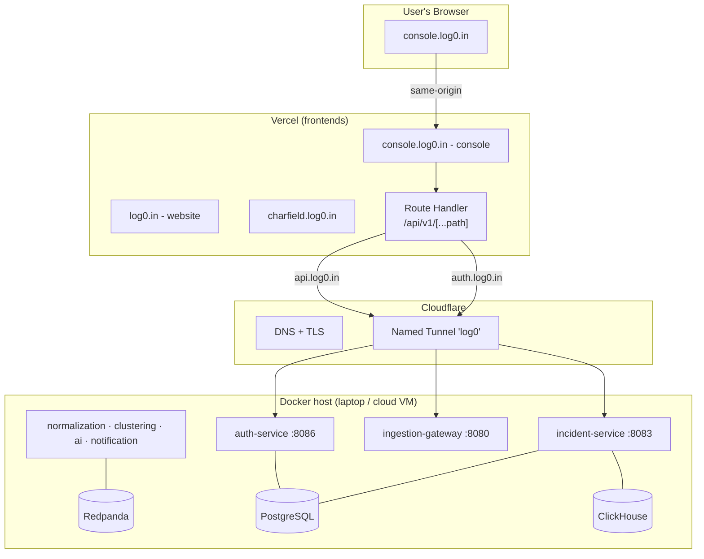

## The Shape of the Deployment

log0 is deployed across three planes, each chosen so the whole system can run for **₹0 of recurring server cost** today and migrate to a paid host later **without touching a line of application code**.

| Plane | Runs where | What lives there |
|---|---|---|
| **Frontends** | Vercel | `log0.in` (website), `console.log0.in` (the console), `charfield.log0.in` |
| **Backend** | Docker on a single host (laptop today, cloud VM later) | 7 Spring Boot services + Redpanda + PostgreSQL + ClickHouse |
| **Edge** | Cloudflare | DNS, free TLS, and a named **Tunnel** that exposes the backend with no public IP |

The design constraint that shaped everything: **no paid server was available yet**, but the work still had to be demoable on a real domain and easy to move to [Oracle Ampere Always Free](https://www.oracle.com/cloud/free/) (or any VM) the moment a card was available. That forced a clean split between *what the app is* and *where it happens to run* - which is exactly the property you want in production anyway.



---

## Frontends on Vercel

Three independent Next.js apps, each its own Vercel project, each on a subdomain of `log0.in`:

| App | Domain | Repo |
|---|---|---|
| Marketing site + these docs | `log0.in` (+ `www` → apex) | `log0-website` |
| Incident console | `console.log0.in` | `log0-console` |
| ASCII animation registry | `charfield.log0.in` | `charfield` |

DNS for all three is `CNAME → vercel-dns` records set **DNS-only (grey cloud)** in Cloudflare. Vercel issues and serves its own TLS; proxying it through Cloudflare on top causes redirect/cert loops, so the proxy is deliberately left off for these records.

### Same-origin API proxy (no CORS)

The console never calls the backend directly from the browser. Instead it calls **its own origin** (`console.log0.in/api/v1/...`), and a server-side **Route Handler** forwards the request to the backend:

```
browser → console.log0.in/api/v1/api-keys      (same-origin, carries cookies)
        → app/api/v1/[...path]/route.ts         (runs on Vercel, server-side)
        → https://api.log0.in / auth.log0.in    (Cloudflare Tunnel)
        → incident-service / auth-service        (Docker)
```

Routing inside the handler is a single rule:

- `/api/v1/incidents/*` and `/api/v1/logs` → `INCIDENTS_API_URL`
- everything else (`auth`, `tenants`, `users`, `api-keys`) → `AUTH_API_URL`

> **Why a Route Handler and not `next.config` rewrites?** The original design used `rewrites()`. On Vercel, that edge proxy returns `500` when the upstream answers a `200` with chunked transfer encoding (every authenticated data response) - error responses with a `Content-Length` passed through, so login worked but every data call failed. The Route Handler buffers the upstream response and returns a clean `Response`, which sidesteps the issue entirely. It keeps the same-origin benefit: the browser only ever talks to the console domain, so there is no CORS and the refresh-token cookie stays first-party.

The backend hostnames are pure configuration - `AUTH_API_URL`, `INCIDENTS_API_URL`, and the browser-visible `NEXT_PUBLIC_INGEST_URL` are Vercel environment variables. Re-point them and the console talks to a different backend with no code change.

---

## Backend in Docker

The entire backend is **one `docker compose up`**: seven application services (six Java, one Python) plus infrastructure, defined in `log0-services/docker/docker-compose.yml`.

| Container | Image | Role |
|---|---|---|
| `redpanda` | `redpandadata/redpanda:v24.2.7` | Kafka-API event bus (no Zookeeper) |
| `redpanda-init` | same | one-shot: creates the 5 topics |
| `postgres` | `postgres:16` | incidents, users, tenants |
| `clickhouse` | `clickhouse/clickhouse-server:24.3` | log events (analytical) |
| 6× Java service | `docker/Dockerfile` | Spring Boot apps |
| ai-service | `services/ai-service/Dockerfile` | Python 3.13 + uv |

### Java services: shared Dockerfile

Six services are Maven + Java 25 Spring Boot apps. One multi-stage `docker/Dockerfile` builds each of them; compose sets `build.context` to the service directory:

```dockerfile
FROM eclipse-temurin:25-jdk AS build
WORKDIR /app
COPY . .
RUN sed -i 's/\r$//' mvnw && chmod +x mvnw          # CRLF-safe for Windows checkouts
RUN --mount=type=cache,target=/root/.m2 ./mvnw -B -q -DskipTests clean package

FROM eclipse-temurin:25-jre
WORKDIR /app
COPY --from=build /app/target/*.jar app.jar
ENV JAVA_OPTS="-XX:MaxRAMPercentage=70.0 -XX:+UseSerialGC"
ENTRYPOINT ["sh","-c","exec java $JAVA_OPTS -jar app.jar"]
```

### ai-service: Python Dockerfile

**ai-service** builds from `services/ai-service/Dockerfile` (Python 3.13, `uv sync`, uvicorn on port 8085). Compose mounts `services/ai-service/.env` and sets `INCIDENT_SERVICE_URL=http://incident-service:8083`. It does not use `SPRING_APPLICATION_JSON`.

### Config injected, source untouched

Each service's `application.yml` keeps `localhost` defaults for bare-metal local dev. In Docker, the container hostnames are injected via `SPRING_APPLICATION_JSON` so the **source is never edited for the container environment**:

```yaml
incident-service:
  environment:
    SPRING_APPLICATION_JSON: >
      {"spring.datasource.url":"jdbc:postgresql://postgres:5432/log0",
       "spring.kafka.bootstrap-servers":"redpanda:9092",
       "clickhouse.url":"jdbc:ch://clickhouse:8123/log0",
       "ai-service.base-url":"http://ai-service:8085"}

ai-service:
  build:
    context: ../services/ai-service
    dockerfile: Dockerfile
  env_file: ../services/ai-service/.env
  environment:
    INCIDENT_SERVICE_URL: http://incident-service:8083
```

Containers reach each other by service name (`postgres:5432`, `redpanda:9092`, `clickhouse:8123`, `<service>:<port>`) on the compose network. Swapping any dependency - say PostgreSQL for a managed Neon database - is one env line, not a code change.

> **Redpanda instead of Apache Kafka.** The broker is now Redpanda, a single Kafka-API-compatible binary with no Zookeeper. Spring Kafka, the topics, and every consumer/producer are unchanged - only `bootstrap-servers` points at `redpanda:9092`. On a single host it saves ~1 GB of RAM (no JVM broker, no Zookeeper) and boots in seconds. See the [Architecture Decisions](/docs/architecture/decisions) for the full rationale.

---

## The Edge: Cloudflare Tunnel

The backend host has **no public IP and no port-forwarding**. A Cloudflare **named tunnel** bridges the public internet to it: `cloudflared` opens an outbound connection to Cloudflare, and Cloudflare routes the public hostnames down that tunnel.

```
internet → https://api.log0.in → Cloudflare → tunnel → incident-service:8083
internet → https://auth.log0.in → Cloudflare → tunnel → auth-service:8086
internet → https://ingest.log0.in → Cloudflare → tunnel → ingestion-gateway:8080
```

This is the **only piece** that knows the backend is reached through Cloudflare, and it lives in its own file, `docker-compose.tunnel.yml`:

```bash
# backend only (local)
docker compose up -d --build

# backend + public tunnel
docker compose -f docker-compose.yml -f docker-compose.tunnel.yml up -d --build
```

Ingress rules (`cloudflared/config.yml`) map each public hostname to a compose service name, so `cloudflared` resolves them on the shared Docker network:

```yaml
ingress:
  - hostname: api.log0.in
    service: http://incident-service:8083
  - hostname: auth.log0.in
    service: http://auth-service:8086
  - hostname: ingest.log0.in
    service: http://ingestion-gateway:8080
  - service: http_status:404
```

Only three of the seven services are public - the console talks to `auth` and `incident`, and external log shippers POST to `ingest`. The other four (normalization, clustering, ai, notification) are internal Redpanda consumers and are never exposed.

> The tunnel was created with the `cloudflared` CLI (`tunnel login` → `tunnel create` → `tunnel route dns`), which needs **no Cloudflare card** - unlike the Zero Trust dashboard flow, which prompts for one even on the free plan. The credentials file is gitignored.

---

## Why This Is Plug-and-Play

The deployment is built like a strategy pattern: the application is fixed, and the **edge** and **host** are interchangeable implementations selected by configuration.

| Varying part | How it's isolated | Swap cost |
|---|---|---|
| **Where the frontend points** | Vercel env vars (`AUTH_API_URL`, `INCIDENTS_API_URL`, `NEXT_PUBLIC_INGEST_URL`) | edit env, redeploy |
| **Where services find their deps** | `SPRING_APPLICATION_JSON` per service in compose | edit one line |
| **How the backend is exposed** | a separate `docker-compose.tunnel.yml` overlay | replace the overlay |
| **Which host runs Docker** | nothing app-specific is hard-coded to the host | `git pull && docker compose up` |

### Migrating to a cloud VM (e.g. Oracle Ampere)

When a paid/free-tier VM becomes available, the move is mechanical:

1. `git pull` the repo on the VM and `docker compose -f docker-compose.yml -f docker-compose.tunnel.yml up -d`.
2. Run the same `cloudflared` tunnel there (move the credentials, or `cloudflared tunnel run log0`).
3. **Done.** `api.log0.in` / `auth.log0.in` / `ingest.log0.in` already point at the tunnel, so DNS is unchanged - and the Vercel env vars are unchanged, so the frontends need **zero** redeploys.

If you later want a "real" public IP + reverse proxy instead of a tunnel, you replace `docker-compose.tunnel.yml` with a Caddy/nginx overlay. The base compose and every service stay exactly as they are.

---

## Operating It

<Tabs items={["Start", "Stop", "Status", "Logs"]}>
  <Tab value="Start">
    ```bash
    cd log0-services/docker
    docker compose -f docker-compose.yml -f docker-compose.tunnel.yml up -d --build
    ```
  </Tab>
  <Tab value="Stop">
    ```bash
    cd log0-services/docker
    docker compose -f docker-compose.yml -f docker-compose.tunnel.yml down
    # data persists in named volumes: postgres_data, clickhouse_data, redpanda_data
    ```
  </Tab>
  <Tab value="Status">
    ```bash
    docker compose ps
    # public health checks
    curl https://api.log0.in/actuator/health
    curl https://auth.log0.in/actuator/health
    ```
  </Tab>
  <Tab value="Logs">
    ```bash
    docker logs log0-incident --tail 50
    docker logs log0-tunnel --tail 20
    ```
  </Tab>
</Tabs>

> The backend is reachable only while the Docker host is on **and** the compose stack (including the tunnel) is running. When the host sleeps, the console's data calls fail until it is back - an accepted trade-off for a zero-cost demo host, and the exact reason the design makes moving to an always-on VM a one-command operation.

---

## Deployment Decisions at a Glance

| Decision | Choice | Why |
|---|---|---|
| Frontend host | Vercel | Native Next.js, free tier, per-app subdomains |
| Backend → browser path | Same-origin Route Handler proxy | No CORS, first-party cookies, avoids the Vercel rewrite-on-200 bug |
| Event bus | Redpanda (Kafka API) | One binary, no Zookeeper, ~1 GB less RAM on a single host |
| Public exposure | Cloudflare named Tunnel | No public IP / port-forwarding, free TLS, no card needed |
| DNS | Cloudflare (registrar: Hostinger) | Free, fast, required for the tunnel; Vercel records kept DNS-only |
| Config strategy | Java: env + `SPRING_APPLICATION_JSON`; ai-service: `.env` + compose env; tunnel overlay | Source never edited per environment; hosts are swappable |
